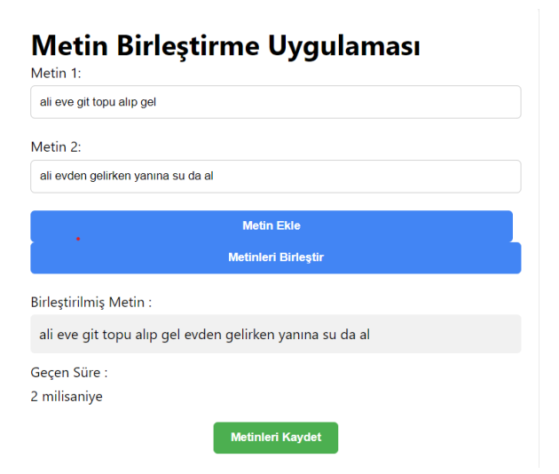

# Text Similarity and Merge Tool

This project includes an algorithm developed for merging texts and an application that merges texts and stores the results in a database. The backend is developed in Java, and it interacts with the MongoDB database using HTTP client-side. Additionally, there is a simple web interface where users can enter texts and view the merged results.

